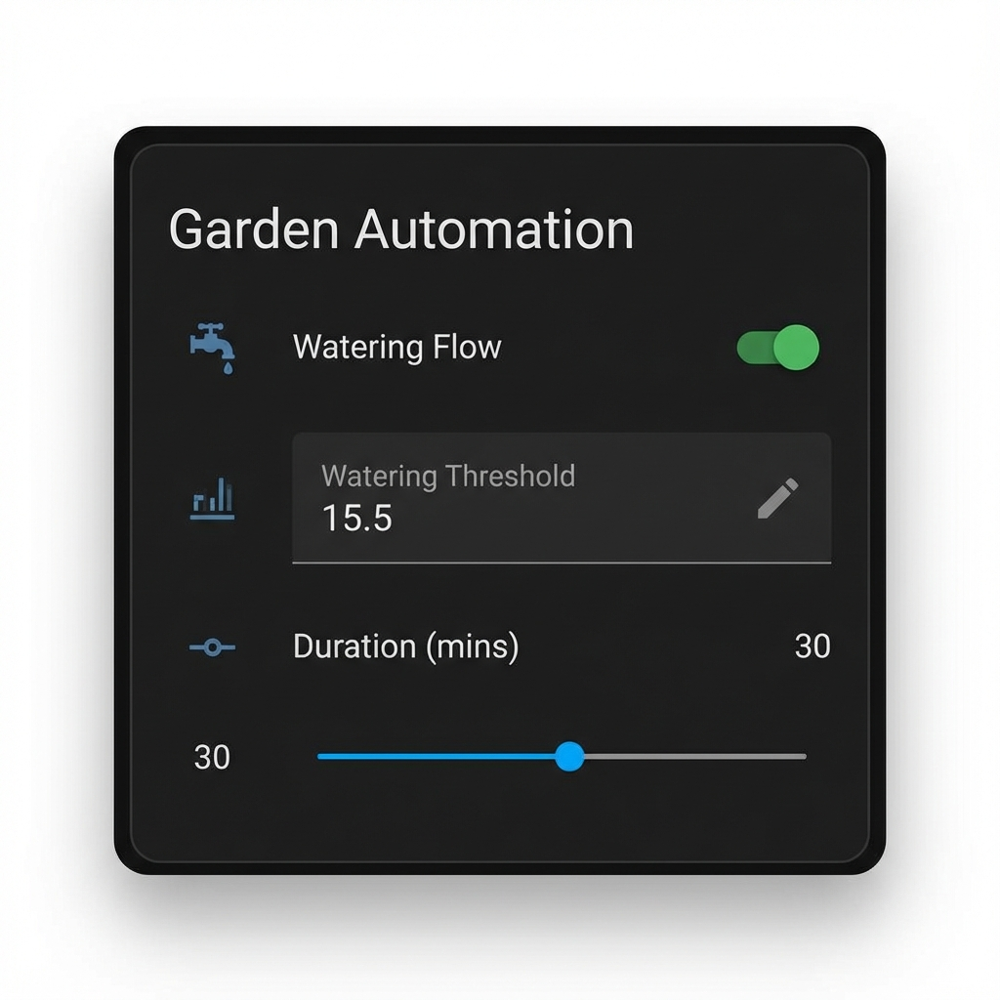

# Node-RED Flow Manager

[](https://github.com/hacs/integration)


[](https://github.com/VilniusTechnology/ha-node-flow-manager/actions/workflows/validate.yaml)

<a href="https://buymeacoffee.com/vilnius.technology" target="_blank"></a>

**Node-RED Flow Manager** is a Home Assistant custom component that allows you to monitor and control your Node-RED flows directly from the Home Assistant dashboard. It discovers your flows automatically and creates a Switch entity for each one, allowing you to enable or disable complex automations with a single toggle.

## ✨ Features
- **Auto-Discovery**: Automatically fetches all flows (tabs) from your Node-RED instance.
- **Real-time Control**: Enable/Disable flows instantly via `switch` entities.
- **Flow Parameters**: Display and edit flow environment variables directly from Home Assistant using `text` and `number` entities.
- **Debug Visibility**: Monitor real-time debug node output for each flow via `sensor` entities.
- **Secure Connection**: Supports username/password authentication and SSL/TLS.
- **Status Monitoring**: See at a glance which automation flows are active.

- **Dynamic Updates**: Integration polls Node-RED every 120 seconds to automatically discover new flows and environment variables.
- **Manual Refresh**: Use the "Refresh Flows" button on the Node-RED Service device to instantly check for changes.
- **Configuration URL**: Direct link to the flow in Node-RED from the Home Assistant Device page.

---

## 📸 Screenshots

### Flow Parameter Editing
Manage your flow settings without opening the Node-RED editor.


---

## 📋 Prerequisites

- **Home Assistant**: Version 2023.1.0 or newer (recommended).
- **Node-RED**: Accessible via network (e.g., addon or separate container).
    - If using **Node-RED Addon** in HA: Ensure the "credential_secret" is set if you want to use authentication, or simpler, use the internal URL `http://nodered.home:1880` (hostname and port may vary).

---

## 🚀 Installation

### Option 1: HACS (Recommended)

Installing via Home Assistant Community Store (HACS) ensures you get automatic updates.

1.  **Open HACS**: Navigate to HACS from the Home Assistant sidebar.
2.  **Add Custom Repository**:
    *   Click the **three dots** (menu) in the top-right corner.
    *   Select **Custom repositories**.
    *   **Repository URL**: `https://github.com/VilniusTechnology/ha-node-flow-manager`
    *   **Category**: Select **Integration**.
    *   Click **Add**.
3.  **Install**:
    *   Search for **Node-RED Flow Manager** in the HACS integrations list.
    *   Click **Download**.
4.  **Restart**: Restart Home Assistant for the custom component to be loaded.

### Option 2: Manual Installation

1.  **Download**: Download the `node-flow-manager` zip or clone the repository.
2.  **Copy Files**:
    *   Locate the `custom_components` folder in your Home Assistant configuration directory (usually `/config/`).
    *   Copy the `custom_components/node_flow_manager` folder from this project into your HA `custom_components` folder.
    *   Directory structure should look like:
        ```
        /config/custom_components/node_flow_manager/__init__.py
        /config/custom_components/node_flow_manager/manifest.json
        ...
        ```
3.  **Restart**: Restart Home Assistant.

---

## ⚙️ Configuration

Once installed, you need to add the integration to Home Assistant.

1.  Navigate to **Settings** > **Devices & Services**.
2.  Click the **+ ADD INTEGRATION** button in the bottom right.
3.  Search for **Node-RED Flow Manager**.
4.  Fill in the connection details:

| Field | Description | Example |
| :--- | :--- | :--- |
| **Host** | The hostname or IP address of your Node-RED instance. | `192.168.1.100` or `localhost` or `nodered.home` depending on your setup. |
| **Port** | The port Node-RED is listening on. | `1880` (default) |
| **Username** | (Optional) Username if `adminAuth` is enabled in Node-RED. | `admin` |
| **Password** | (Optional) Password for the above user. | `password123` |
| **Verify SSL** | Check this if using HTTPS with a valid certificate. | `Unchecked` (default) |
| **Public URL** | (Optional) External URL to link to Node-RED from HA. | `http://nodered.home` |

5.  Click **Submit**. If the connection is successful, you will be prompted to assign the device to an area.
6.  To change these settings later (e.g. update Public URL), go to the integration card and click **Configure**.

---

## 💡 Usage

### Viewing Flows
1.  Navigate to **Settings** > **Devices & Services**.
2.  Click on **Devices** within the **Node-RED Flow Manager** integration card.
3.  Each **Flow** (Tab) in Node-RED appears as its own **Device**.
4.  Click on a Flow Device to see all its controls (Switch, Params, Debug) and a link to open it in Node-RED.
6.  The **Node-RED Service** device contains the **Refresh Flows** button.

### Controlling Flows
- **Turn Off**: Disabling the switch will set the underlying Node-RED flow to `disabled: true`. The flow will stop processing messages immediately.
- **Turn On**: Enabling the switch sets `disabled: false`. The flow resumes operation.

### Configuring Flow Parameters
1.  Each environment variable in a Node-RED flow is automatically exposed as a **Text** or **Number** entity.
2.  Changing these values in Home Assistant updates the Node-RED flow configuration safely (without losing other settings).

### Monitoring Debug Output
1.  A **Debug Sensor** is created for each flow.
2.  The sensor state shows the latest debug message.
3.  The `history` attribute contains the last 20 debug messages with timestamps and node IDs.


### Force Update / Refresh
To manually force an update of the flows (e.g., after adding a new flow in Node-RED):
1.  Navigate to **Settings** > **Devices & Services**.
2.  Select the **Node-RED Flow Manager** integration.
3.  Click on the **Node-RED Service** device.
4.  Press the **Refresh Flows** button.

### Automation Example
You can now use these switches in Home Assistant automations!

**Example**: Disable "Holiday Mode" flow when you arrive home.

```yaml
automation:
  - alias: "Disable Holiday Automations"
    trigger:
      - platform: state
        entity_id: group.family
        to: "home"
    action:
      - service: switch.turn_off
        target:
          entity_id: switch.holiday_lights_flow
```

---

## 🗑️ Uninstall

To remove the integration:

1.  **Remove Integration Entry**:
    *   Go to **Settings** > **Devices & Services**.
    *   Find **Node-RED Flow Manager**.
    *   Click the **three dots** on the integration card and select **Delete**.
2.  **Remove Component Files**:
    *   **If installed via HACS**:
        *   Open HACS > Integrations.
        *   Find **Node-RED Flow Manager**.
        *   Click the three dots and select **Remove**.
    *   **If installed manually**:
        *   Delete the `custom_components/node_flow_manager` directory from your configuration folder.
3.  **Restart**: Restart Home Assistant.

---

## ☕ Support

If you find this integration useful and want to support its development:

<a href="https://buymeacoffee.com/vilnius.technology" target="_blank"></a>

---

## ❓ Troubleshooting

- **"Failed to connect"**: Ensure the Host/IP is reachable from the Home Assistant container. If running Node-RED as an addon, try using the container name (e.g., `a0d7b954-nodered`).
- **Authentication Error**: Verify your Node-RED `settings.js` `adminAuth` configuration.
- **Entities not showing**: Only "Tabs" are created as switches. Sub-flows or individual nodes are not currently supported.
